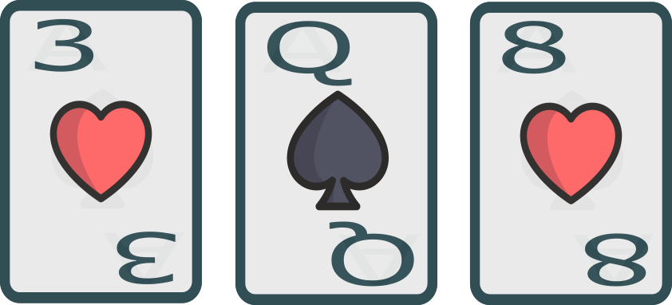
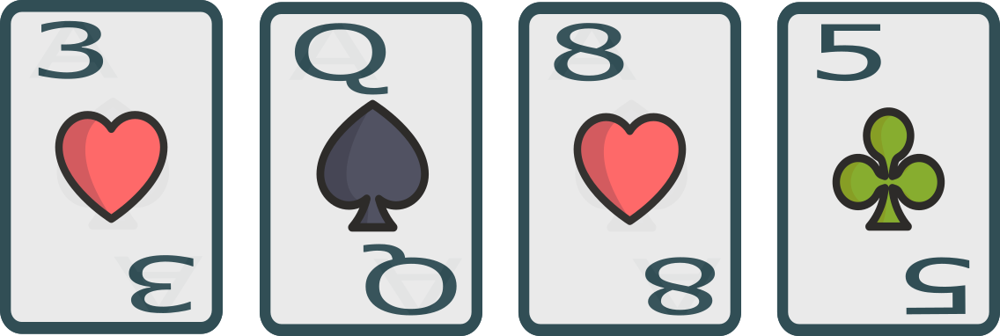

# Exemple #1

Cash Game

**BTN relance**

**BB suit**

**FLOP**

**BB check**

**BTN mise 1/2p**

**BB paye**

**Quelle est la main de BTN ?**

**TURN**

**BB donk 1/3p**

## Auriez-vous fait la même chose ?

**BTN passe**
<!--stackedit_data:
eyJoaXN0b3J5IjpbODgxMjgyNzkzLC0zMzk2MTA4NjUsLTgyMD
Y0NjE1OSw1NTY0ODExNzVdfQ==
-->