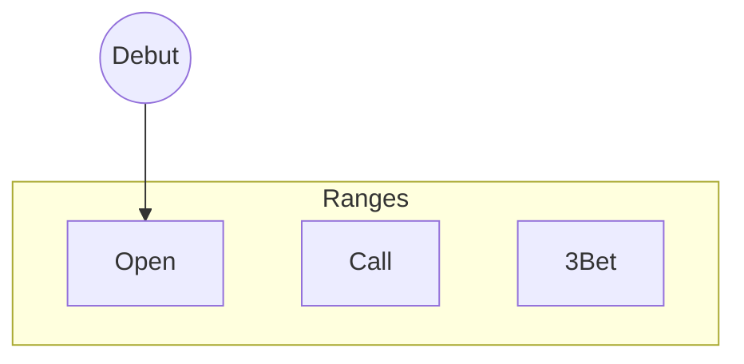

Il y a deux aspects du jeu qu'un joueur de poker doit savoir gérer.

# La macro-gestion

C'est un terme emprunter aux joueurs de jeux vidéo.

Au poker, c'est la façon de gérer :
- Son capital (bankroll)
- Son volume de jeu
- Le travail technique hors des tables
- Son hygiène de vie
- Les sites sur lesquels on joue
- Le format que l'on joue
- Organisation de ses sessions
	- Son setup pour jouer
	- La sélection des tables
	- Les moments pour jouer

&nbsp;
#### Le BRM ou BankRoll Management

L'argent est un levier important, plus on va pouvoir commencer avec une bankroll importante plus on pourra arriver loin.

Type de jeu|Bankroll
-|-
Cash Game Online|100 BI
Cash Game Live|50 BI
MTT Online|200 BI
SnG|150 à 300 BI

Il faut aussi mettre en place des règles de montée de limites.

&nbsp;
# La technique

La technique quand à elle va concerner le jeu en tant que tel.

Il faudra se perfectionner sur les sujets suivants:

- Comprendre les dynamiques préflop
- Définir les ranges préflop
	- les ranges d'open
	- les ranges de cold call
	- les ranges de 3bet
- Le jeu vs les 3bet/4bet
- Etude du jeu en batailler de blindes
- L'importance de la position
- Comprendre les situations de jeu postflop
	- Miser pour value ou en bluff
	- Sizing
	- La notion de ranges capées
	- Exploitation ou équilibre
- La prise de note

<!--stackedit_data:
eyJoaXN0b3J5IjpbLTExMTg0ODEyODEsLTkzOTI1NDY1MCw1ND
E4ODU3MCwxMzQ0ODM5ODMsMTg4MTYwMzE2OSwxNzkwMjc5MzE2
LDE3OTAyNzkzMTYsMTQxNTM4NzYyLC05OTk2OTE1NjcsLTg1MT
k2NDkyNCwtMTU5NDk3NTMwNSwtMTY0Nzg1MzYyMywxMzU4MDE0
ODgyLC0yMDg4NzQ2NjEyXX0=
-->