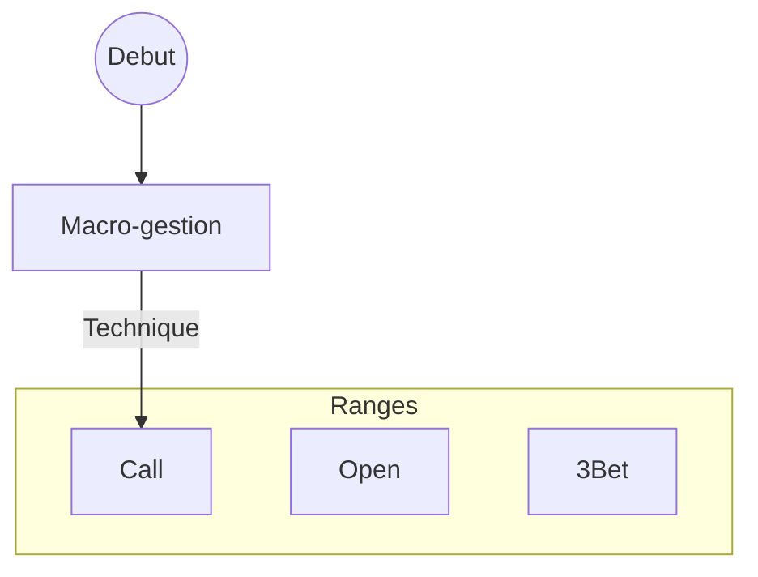

```mermaid
graph TB
A((Debut)) --> M[Macro-gestion]
M -- Technique --> Call
subgraph Ranges
Open
Call
3Bet
end
```

<!--stackedit_data:
eyJoaXN0b3J5IjpbODY2NjM5Mzg3LC0yMDk4NDA0Mjg3LC01Nz
Y2NDMyMDFdfQ==
-->