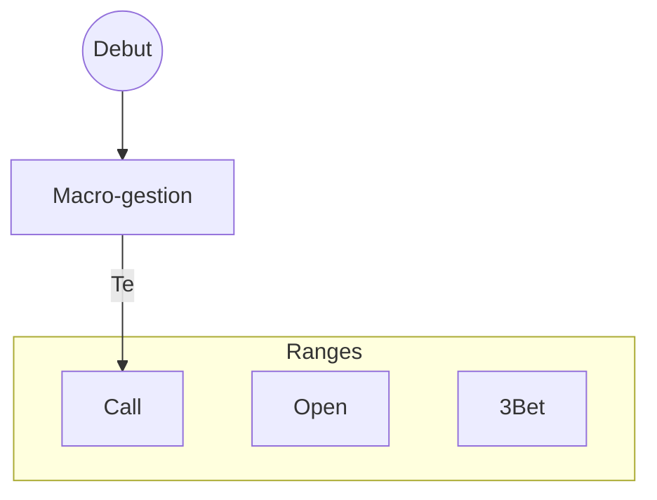

```mermaid
graph TB
A((Debut)) --> M[Macro-gestion]
M -- Te --> Call
subgraph Ranges
Open
Call
3Bet
end
```

<!--stackedit_data:
eyJoaXN0b3J5IjpbLTEzNjM4MDExNTgsLTIwOTg0MDQyODcsLT
U3NjY0MzIwMV19
-->