# La macro-gestion
&nbsp;
#### Le BRM ou BankRoll Management

Voici un exemple de gestion de bankroll et de répartion de son capital. Avec un capital de 3600€ nous allons jouer en NL25 et nous allons réserver 600€ pour divers challenge de bankroll.

Type de jeu|Bankroll
-|-:
Cash Game Online|3 000 €
Challenge 100€|100 €
Challenge 500€|500 €

&nbsp;
# La technique

On peut représenter notre progression avec un diagramme. Chaque nouvelle étapes fera l'objet d'un apprentissage particulier et d'un travail sur les tables. 

#### Les mathématiques du Poker

###### La formule du "risk/reward"

C'est le ratio entre ce qu'il y a à gagner et le coût du risque que l'on prend.

$C_{risque} = \dfrac{Risque}{Risque + Récompense}$

&nbsp;
#### Comprendre les dynamiques Préflop

Pour bien comprendre les dynamiques, il faut bien comprendre pourquoi on décide de rentrer dans un coup ou pas.
Quand un joueur ouvre une main c'est pour gagner de l'argent sur le long terme. Soit en volant les blindes, soit en étant payé par des mains moins bonne que la sienne.

Si il ouvre, à 3bb, UTG, il gagnera de l'argent automatiquement si 66,7% du temps les autres joueurs fold.

$\dfrac{3}{3 + 1,5} = 66,7$

La table (oui car nous ne sommes pas seul contre le joueur) devra donc défendre 33,3% du temps pour l'éviter de faire un profit immédiat. Cela représente 7,8% par joueur contre UTG.
{: .text-justify}

Voici les fréquences par joueur contre chaque positions :

Position|Fréquence
-|-:
UTG|7,8
MP|9,6
CO|12,6
BTN|18,4
SB|33,3

Nous pouvons remarquer que plus un joueur va ouvrir en position tardive plus il nous faudra défendre. Cela implique donc que plus un joueur ouvrira en position tardive plus il fera face a une range large et donc plus il pourra élargir sa propre range. 
{: .text-justify}

<!--stackedit_data:
eyJoaXN0b3J5IjpbLTg3MDA1OTY3NSw1ODEwODY1MywxNzM2OT
c0NzM4LDkwNzAyMjExMiwxMjA5Nzc4OTY3LDEyMDk3Nzg5Njcs
LTE2ODIzMzE1NjUsMTE2NDE2NjI2OSwtMjA3ODk2NjMwMCw4Nj
Y2MzkzODcsLTIwOTg0MDQyODcsLTU3NjY0MzIwMV19
-->