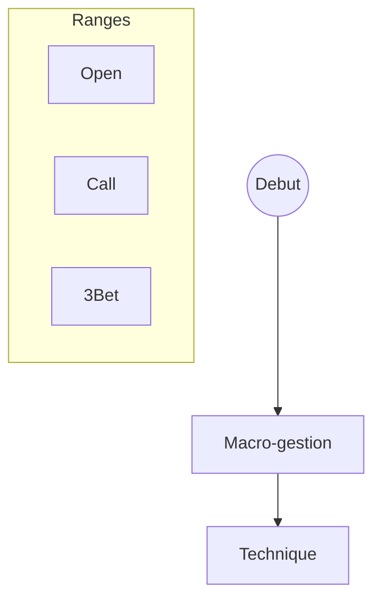

```mermaid
graph TB
A((Debut)) --> Macro[Macro-gestion] --> Technique
subgraph Ranges
Open
Call
3Bet
end
```

<!--stackedit_data:
eyJoaXN0b3J5IjpbMjk2NjU0Njc3LC0yMDk4NDA0Mjg3LC01Nz
Y2NDMyMDFdfQ==
-->