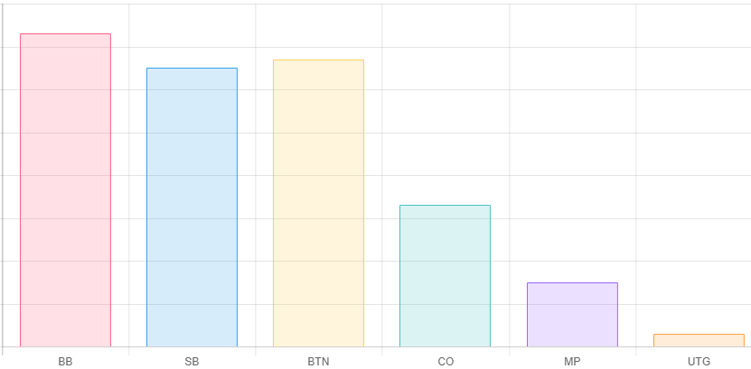

#### Les mathématiques du Poker

###### La formule du "risk/reward"

C'est le ratio entre ce qu'il y a à gagner et le coût du risque que l'on prend.

$C_{risque} = \dfrac{Risque}{Risque + Récompense}$

&nbsp;
#### Comprendre les dynamiques Préflop

Pour bien comprendre les dynamiques, il faut bien comprendre pourquoi on décide de rentrer dans un coup ou pas.
Quand un joueur ouvre une main c'est pour gagner de l'argent sur le long terme. Soit en volant les blindes, soit en étant payé par des mains moins bonne que la sienne.
{: .text-justify}

Si il ouvre, à 3bb, UTG, il gagnera de l'argent automatiquement si 66,7% du temps les autres joueurs fold.
{: .text-justify}

$\dfrac{3}{3 + 1,5} = 66,7$

La table (oui car nous ne sommes pas seul contre le joueur) devra donc défendre 33,3% du temps pour l'éviter de faire un profit immédiat. Cela représente 7,8% par joueur contre UTG.
{: .text-justify}

Voici les fréquences par joueur contre chaque positions :

Position|Fréquence
-|-:
UTG|7,8
MP|9,6
CO|12,6
BTN|18,4
SB|33,3

Nous pouvons remarquer que plus un joueur va ouvrir en position tardive plus il nous faudra défendre. Cela implique donc que plus un joueur ouvrira en position tardive plus il fera face a une range large et donc plus il pourra élargir sa propre range. 
{: .text-justify}

Si on fait quelques statistiques sur les actions par position on obtient ceci :

Cela met en évidence les 3 positions ou les dynamiques préflop sont les plus importantes, BTN, SB et BB.
<!--stackedit_data:
eyJoaXN0b3J5IjpbMTIyMjM1MDIyNCwtMTAxODA0MzEwMCw0NT
AwNjczODEsMjEyNjM1OTE3Miw3MzA5OTgxMTZdfQ==
-->