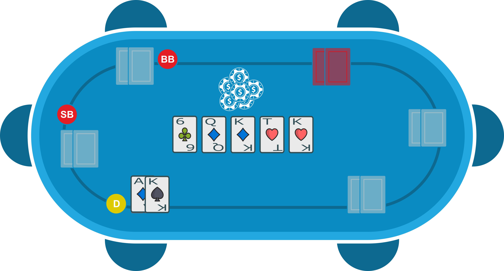

**Le contexte**

Nous sommes dans un MTT 10€.
Nous ne sommes pas encore dans les places payées mais nous sommes déjà bien avancés.

**UTG (30bb) relance a 2x**

## Quelle est la range de UTG?

> Avec cette profondeur on peut lui affecter la range suivante :
> [AA-22,AKo-ATo,KQo-KJo,QJo,AKs-ATs,A5s-A2s,KQs-KTs,QJs-QTs,JTs]

**Hero (BTN) call**

## Auriez-vous fait la même chose ?

<!--stackedit_data:
eyJoaXN0b3J5IjpbMTU3NTA2MDQ0NSwtMTUxODk0NjM1NCwtMT
A1MDIxODU3OCwyMDk3NDc5OTg0LDEyNDA5MTU0OTldfQ==
-->